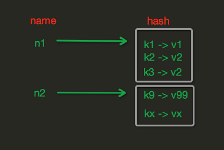
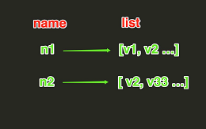
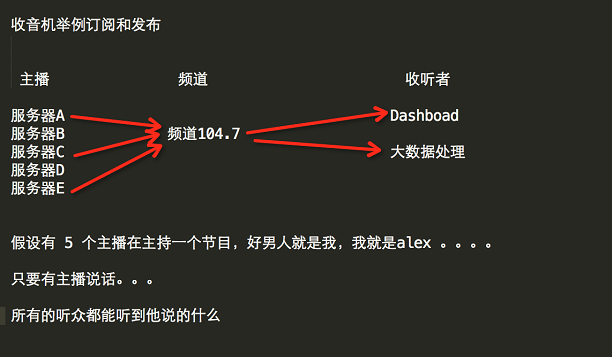

### 一、python连接redis

在python中，要操作redis，目前主要是通过一个python-redis模块来实现

1、在python中安装redis模块

```
1 pip3 install redis
```

2、在python中使用redis

跟其他模块一样，在安装好redis模块后，要使用redis模块就要先导入。

python连接redis数据库：

```python
 1 #!/usr/bin/env python
 2 # -*- coding:utf8 -*-
 3 
 4 import redis
 5 
 6 '''
 7 这种连接是连接一次就断了，耗资源.端口默认6379，就不用写
 8 r = redis.Redis(host='127.0.0.1',port=6379,password='tianxuroot')
 9 r.set('name','root')
10 
11 print(r.get('name').decode('utf8'))
12 '''
13 '''
14 连接池：
15 当程序创建数据源实例时，系统会一次性创建多个数据库连接，并把这些数据库连接保存在连接池中，当程序需要进行数据库访问时，
16 无需重新新建数据库连接，而是从连接池中取出一个空闲的数据库连接
17 '''
18 pool = redis.ConnectionPool(host='127.0.0.1',password='helloworld')   #实现一个连接池
19 
20 r = redis.Redis(connection_pool=pool)
21 r.set('foo','bar')
22 print(r.get('foo').decode('utf8'))
```

### 二、Redis API使用

redis-py 的API的使用可以分类为：

连接方式
连接池
操作
String 操作
Hash 操作
List 操作
Set 操作
Sort Set 操作
管道
发布订阅
前面通过一个连接实例来简述了python用过redis模块连接redis数据库的连接方式和连接池。

接下来主要看如何通过python来操作redis数据库：

#### 1. string操作

redis中的String在在内存中按照一个name对应一个value来存储。如图：


```python
set(name, value, ex=None, px=None, nx=False, xx=False)
　　在Redis中设置值，默认，不存在则创建，存在则修改
　　参数：
     　　ex，过期时间（秒）
     　　px，过期时间（毫秒）
     　　nx，如果设置为True，则只有name不存在时，当前set操作才执行
     　　xx，如果设置为True，则只有name存在时，岗前set操作才执行

setnx(name, value)
    #设置值，只有name不存在时，执行设置操作（添加）

setex(name, value, time)
　　# 设置值
　　# 参数：
        # time，过期时间（数字秒 或 timedelta对象）
psetex(name, time_ms, value)
　　# 设置值
　　# 参数：
　　　　# time_ms，过期时间（数字毫秒 或 timedelta对象）

mset(*args, **kwargs)
    批量设置值
　　如：
        mset(k1='v1', k2='v2')
        或
        mget({'k1': 'v1', 'k2': 'v2'})

get(name)
    获取值

mget(keys, *args)
    批量获取
　　 如：
        mget('name', 'root')
        或
        r.mget(['name', 'root'])

getset(name, value)
    设置新值并获取原来的值

getrange(key, start, end)
    # 获取子序列（根据字节获取，非字符）
　　# 参数：
        #name，Redis 的 name
        # start，起始位置（字节）
        # end，结束位置（字节）
　　# 如： "你好" ，0-3表示 "你"   (utf8中一个中文字符占三个字节)

setrange(name, offset, value)
    # 修改字符串内容，从指定字符串索引开始向后替换（新值太长时，则向后添加）
　　# 参数：
        # offset，字符串的索引，字节（一个汉字三个字节）
        # value，要设置的值

setbit(name, offset, value)
    # 对name对应值的二进制表示的位进行操作
　　# 参数：
        # name，redis的name
        # offset，位的索引（将值变换成二进制后再进行索引）
        # value，值只能是 1 或 0
 
　　# 注：如果在Redis中有一个对应： n1 = "foo"，
        那么字符串foo的二进制表示为：01100110 01101111 01101111
        所以，如果执行 setbit('n1', 7, 1)，则就会将第7位设置为1，
        那么最终二进制则变成 01100111 01101111 01101111，即："goo"
 
　　# 扩展，转换二进制表示：
    # source = "你好啊"
        source = "foo"
 
    for i in source:
        num = ord(i)
        print bin(num).replace('b','')
 
    特别的，如果source是汉字 "你好啊"怎么办？
    答：对于utf-8，每一个汉字占 3 个字节，那么 "人生苦短" 则有 12个字节
       对于汉字，for循环时候会按照 字节 迭代，那么在迭代时，将每一个字节转换 十进制数，然后再将十进制数转换成二进制
10101101 10100110 11100110 10110010 10011011 11101001 10111101 10010000
        -------------------------- ----------------------------- -----------------------------
                 你                               好                           啊
　　*用途举例，用最省空间的方式，存储在线用户数及分别是哪些用户在线
 
getbit(name, offset)
    # 获取name对应的值的二进制表示中的某位的值 （0或1）

bitcount(key, start=None, end=None)
    # 获取name对应的值的二进制表示中 1 的个数
　　# 参数：
        # key，Redis的name
        # start，位起始位置
        # end，位结束位置

strlen(name)
    # 返回name对应值的字节长度（一个汉字3个字节）

incr(self, name, amount=1)
    # 自增 name对应的值，当name不存在时，则创建name＝amount，否则，则自增。
　　# 参数：
        # name,Redis的name
        # amount,自增数（必须是整数）
 
　　# 注：同incrby

incrbyfloat(self, name, amount=1.0)
    # 自增 name对应的值，当name不存在时，则创建name＝amount，否则，则自增。
　　# 参数：
        # name,Redis的name
        # amount,自增数（浮点型）

decr(self, name, amount=1)
    # 自减 name对应的值，当name不存在时，则创建name＝amount，否则，则自减。 
　　# 参数：
        # name,Redis的name
        # amount,自减数（整数）

append(key, value)
    # 在redis name对应的值后面追加内容
　　# 参数：
        key, redis的name
            value, 要追加的字符串
```

#### 2.hash操作

hash表现形式上有些像pyhton中的dict,可以存储一组关联性较强的数据 ， redis中Hash在内存中的存储格式如下图：



```python
hset(name, key, value)
　　# name对应的hash中设置一个键值对（不存在，则创建；否则，修改）， 注意： 在python中，键值对是dict， 这里的name必须是dict格式。eg：xxx[]、　xxx[k]...     
　　# 参数：
        # name，redis的name
        #key，name对应的hash中的key
        # value，name对应的hash中的value
　　# 注：
        # hsetnx(name, key, value),当name对应的hash中不存在当前key时则创建（相当于添加）

hmset(name, mapping)
　　# 在name对应的hash中批量设置键值对 
　　# 参数：
        # name，redis的name
        # mapping，字典，如：{'k1':'v1', 'k2': 'v2'}
　　# 如：
        # r.hmset('xx', {'k1':'v1', 'k2': 'v2'})

hget(name,key)
　　# 在name对应的hash中获取根据key获取value

hmget(name, keys, *args)
　　# 在name对应的hash中获取多个key的值
　　# 参数：
        # name，reids对应的name
        # keys，要获取key集合，如：['k1', 'k2', 'k3']
        # *args，要获取的key，如：k1,k2,k3
　　# 如：
        # r.mget('xx', ['k1', 'k2'])
        # 或
        # print r.hmget('xx', 'k1', 'k2')

hgetall(name)
　　#获取name对应hash的所有键值

hlen(name)
　　# 获取name对应的hash中键值对的个数

hkeys(name)
　　# 获取name对应的hash中所有的key的值

hvals(name)
　　# 获取name对应的hash中所有的value的值

hexists(name, key)
　　# 检查name对应的hash是否存在当前传入的key

hdel(name,*keys)
　　# 将name对应的hash中指定key的键值对删除

hincrby(name, key, amount=1)
　　# 自增name对应的hash中的指定key的值，不存在则创建key=amount
　　# 参数：
        # name，redis中的name
           # key， hash对应的key
        # amount，自增数（整数）

hincrbyfloat(name, key, amount=1.0)
　　# 自增name对应的hash中的指定key的值，不存在则创建key=amount
　　# 参数：
        # name，redis中的name
        # key， hash对应的key
        # amount，自增数（浮点数）
　　# 自增name对应的hash中的指定key的值，不存在则创建key=amount

hscan(name, cursor=0, match=None, count=None)
　　Start a full hash scan with:
　　HSCAN myhash 0
　　Start a hash scan with fields matching a pattern with:
　　HSCAN myhash 0 MATCH order_*
　　Start a hash scan with fields matching a pattern and forcing the scan command to do more scanning with:
　　HSCAN myhash 0 MATCH order_* COUNT 1000
　　# 增量式迭代获取，对于数据大的数据非常有用，hscan可以实现分片的获取数据，并非一次性将数据全部获取完，从而放置内存被撑爆
　　# 参数：
        # name，redis的name
          # cursor，游标（基于游标分批取获取数据）
        # match，匹配指定key，默认None 表示所有的key
        # count，每次分片最少获取个数，默认None表示采用Redis的默认分片个数
　　# 如：
        # 第一次：cursor1, data1 = r.hscan('xx', cursor=0, match=None, count=None)
        # 第二次：cursor2, data1 = r.hscan('xx', cursor=cursor1, match=None, count=None)
        # ...
        # 直到返回值cursor的值为0时，表示数据已经通过分片获取完毕
 
hscan_iter(name, match=None, count=None)
　　# 利用yield封装hscan创建生成器，实现分批去redis中获取数据     
　　# 参数：
        # match，匹配指定key，默认None 表示所有的key
        # count，每次分片最少获取个数，默认None表示采用Redis的默认分片个数
　　# 如：
        # for item in r.hscan_iter('xx'):
        # print item
```

#### 3.list操作

redis中的List在在内存中按照一个name对应一个List来存储。如图： 



```python
lpush(name,values)
　　# 在name对应的list中添加元素，每个新的元素都添加到列表的最左边
　　# 如：
        # r.lpush('oo', 11,22,33)
        # 保存顺序为: 33,22,11
　　# 扩展：
        # rpush(name, values) 表示从右向左操作

lpushx(name,value)
　　# 在name对应的list中添加元素，只有name已经存在时，值添加到列表的最左边
　　# 更多：
        # rpushx(name, value) 表示从右向左操作

llen(name)
　　# name对应的list元素的个数

linsert(name, where, refvalue, value))
　　# 在name对应的列表的某一个值前或后插入一个新值
　　# 参数：
        # name，redis的name
        # where，BEFORE或AFTER
        # refvalue，标杆值，即：在它前后插入数据
        # value，要插入的数据

r.lset(name, index, value)
　　# 对name对应的list中的某一个索引位置重新赋值     
　　# 参数：
        # name，redis的name
        # index，list的索引位置
        # value，要设置的值

r.lrem(name, value, num)
　　# 在name对应的list中删除指定的值
　　# 参数：
        # name，redis的name
        # value，要删除的值
        # num，num=0，删除列表中所有的指定值；
             # num=2,从前到后，删除2个；
             # num=-2,从后向前，删除2个

lpop(name)
　　# 在name对应的列表的左侧获取第一个元素并在列表中移除，返回值则是第一个元素
　　# 更多：
        # rpop(name) 表示从右向左操作

lindex(name, index)
　　#在name对应的列表中根据索引获取列表元素

lrange(name, start, end)
　　# 在name对应的列表分片获取数据
　　# 参数：
        # name，redis的name
        # start，索引的起始位置
        # end，索引结束位置

ltrim(name, start, end)
　　# 在name对应的列表中移除没有在start-end索引之间的值
　　# 参数：
        # name，redis的name
        # start，索引的起始位置
        # end，索引结束位置

rpoplpush(src, dst)
　　# 从一个列表取出最右边的元素，同时将其添加至另一个列表的最左边
　　# 参数：
        # src，要取数据的列表的name
        # dst，要添加数据的列表的name

blpop(keys, timeout)
　　# 将多个列表排列，按照从左到右去pop对应列表的元素
　　# 参数：
        # keys，redis的name的集合
        # timeout，超时时间，当元素所有列表的元素获取完之后，阻塞等待列表内有数据的时间（秒）, 0 表示永远阻塞
 
　　# 更多：
        # r.brpop(keys, timeout)，从右向左获取数据

brpoplpush(src, dst, timeout=0)
　　# 从一个列表的右侧移除一个元素并将其添加到另一个列表的左侧
　　# 参数：
        # src，取出并要移除元素的列表对应的name
        # dst，要插入元素的列表对应的name
        # timeout，当src对应的列表中没有数据时，阻塞等待其有数据的超时时间（秒），0 表示永远阻塞
```

#### 4.set集合操作

Set集合就是不允许重复的列表。这里包括了一般的集合和有序集合。

```python
sadd(name,values)
　　# name对应的集合中添加元素

scard(name)
　　#获取name对应的集合中元素个数

sdiff(keys, *args)
　　#在第一个name对应的集合中且不在其他name对应的集合的元素集合

sdiffstore(dest, keys, *args)
　　# 获取第一个name对应的集合中且不在其他name对应的集合，再将其新加入到dest对应的集合中

sinter(keys, *args)
　　# 获取多一个name对应集合的并集

sinterstore(dest, keys, *args)
　　# 获取多一个name对应集合的并集，再讲其加入到dest对应的集合中

sismember(name, value)
　　# 检查value是否是name对应的集合的成员

smembers(name)
　　# 获取name对应的集合的所有成员

smove(src, dst, value)
　　# 将某个成员从一个集合中移动到另外一个集合

spop(name)
　　# 从集合的右侧（尾部）移除一个成员，并将其返回

srandmember(name, numbers)
　　# 从name对应的集合中随机获取 numbers 个元素

srem(name, values)
　　# 在name对应的集合中删除某些值

sunion(keys, *args)
　　# 获取多一个name对应的集合的并集

sunionstore(dest,keys, *args)
　　# 获取多一个name对应的集合的并集，并将结果保存到dest对应的集合中

sscan(name, cursor=0, match=None, count=None)
sscan_iter(name, match=None, count=None)
　　# 同字符串的操作，用于增量迭代分批获取元素，避免内存消耗太大
```

#### 5.zset有序集合操作

有序集合是在集合的基础上，为每元素排序；元素的排序需要根据另外一个值来进行比较，所以，对于有序集合，每一个元素有两个值，即：值和分数，分数专门用来做排序。

```python
zadd(name, *args, **kwargs)
　　# 在name对应的有序集合中添加元素
　　# 如：
        # zadd('zz', 'n1', 1, 'n2', 2)
        # 或
        # zadd('zz', n1=11, n2=22)

zcard(name)
　　# 获取name对应的有序集合元素的数量

zcount(name, min, max)
　　# 获取name对应的有序集合中分数 在 [min,max] 之间的个数

zincrby(name, value, amount)
　　# 自增name对应的有序集合的 name 对应的分数

r.zrange( name, start, end, desc=False, withscores=False, score_cast_func=float)
　　# 按照索引范围获取name对应的有序集合的元素
　　# 参数：
        # name，redis的name
        # start，有序集合索引起始位置（非分数）
        # end，有序集合索引结束位置（非分数）
        # desc，排序规则，默认按照分数从小到大排序
        # withscores，是否获取元素的分数，默认只获取元素的值
        # score_cast_func，对分数进行数据转换的函数

　　# 更多：
        # 从大到小排序
        # zrevrange(name, start, end, withscores=False, score_cast_func=float)
    # 按照分数范围获取name对应的有序集合的元素
        # zrangebyscore(name, min, max, start=None, num=None, withscores=False, score_cast_func=float)
        # 从大到小排序
        # zrevrangebyscore(name, max, min, start=None, num=None, withscores=False, score_cast_func=float)

zrank(name, value)
　　# 获取某个值在 name对应的有序集合中的排行（从 0 开始）
　　# 更多：
        # zrevrank(name, value)，从大到小排序

zrem(name, values)
　　# 删除name对应的有序集合中值是values的成员
　　# 如：zrem('zz', ['s1', 's2'])

zremrangebyrank(name, min, max)
　　# 根据排行范围删除

zremrangebyscore(name, min, max)
　　# 根据分数范围删除

zscore(name, value)
　　# 获取name对应有序集合中 value 对应的分数

zinterstore(dest, keys, aggregate=None)
　　# 获取两个有序集合的交集，如果遇到相同值不同分数，则按照aggregate进行操作
　　# aggregate的值为:  SUM  MIN  MAX
　　
zunionstore(dest, keys, aggregate=None)
　　# 获取两个有序集合的并集，如果遇到相同值不同分数，则按照aggregate进行操作
　　# aggregate的值为:  SUM  MIN  MAX

zscan(name, cursor=0, match=None, count=None, score_cast_func=float)
zscan_iter(name, match=None, count=None,score_cast_func=float)
　　# 同字符串相似，相较于字符串新增score_cast_func，用来对分数进行操作
```

#### 6.其他操作

```python
delete(*names)
　　# 根据删除redis中的任意数据类型

exists(name)
　　# 检测redis的name是否存在

keys(pattern='*')
　　# 根据模型获取redis的name
　　# 更多：
        # KEYS * 匹配数据库中所有 key 。
        # KEYS h?llo 匹配 hello ， hallo 和 hxllo 等。
        # KEYS h*llo 匹配 hllo 和 heeeeello 等。
        # KEYS h[ae]llo 匹配 hello 和 hallo ，但不匹配 hillo

expire(name ,time)
　　# 为某个redis的某个name设置超时时间

rename(src, dst)
　　# 对redis中src的name重命名为dst

move(name, db))
　　# 将redis的某个值移动到指定的db下

randomkey()
　　# 随机获取一个redis的name（不删除）

type(name)
　　# 获取name对应值的类型

scan(cursor=0, match=None, count=None)
scan_iter(match=None, count=None)
　　# 同字符串操作，用于增量迭代获取key
```

### 三、管道

redis-py默认在执行每次请求都会创建（连接池申请连接）和断开（归还连接池）一次连接操作，如果想要在一次请求中指定多个命令，则可以使用pipline实现一次请求指定多个命令，并且默认情况下一次pipline 是原子性操作。 

```python
#!/usr/bin/env python
# -*- coding:utf-8 -*-

import redis
 
pool = redis.ConnectionPool(host='192.168.22.132', port=6379)
r = redis.Redis(connection_pool=pool)

# pipe = r.pipeline(transaction=False)
pipe = r.pipeline(transaction=True)

pipe.set('name', 'root')
pipe.set('role', 'root')

pipe.execute()
```

### 四、发布与订阅



发布者：服务器

订阅者：Dashboad和数据处理

redis_helper:

```python
#!/usr/bin/env python
# -*- coding:utf8 -*-

import redis

class RedisHelper(object):

    def __init__(self):
        self.__conn = redis.Redis(host='localhost')   #连接本机，ip不用写
        self.chan_sub = 'fm104.5'
        self.chan_pub = 'fm86'  #这个频道没用到啊...

    def public(self,msg):
        self.__conn.publish(self.chan_sub,msg)
        return True

    def subscribe(self):
        pub = self.__conn.pubsub()
        pub.subscribe(self.chan_sub)  #订阅的频道
        pub.parse_response()  #准备好监听(再调用一次就是开始监听)
        return pub
```

redis订阅： 

```python
#!/usr/bin/env python
# -*- coding:utf8 -*-

from redis_helper import RedisHelper

obj = RedisHelper()
redis_sub = obj.subscribe()

while True:
    msg = redis_sub.parse_response()
    print(msg)   #[b'message', b'fm104.5', b'who are you?']
    # print(msg[2].decode('utf8'))
```

redis发布： 

```python
#!/usr/bin/env python
# -*- coding:utf8 -*-

'''
发布与订阅是不同于存值取值，存值取值不需要同步，发布与订阅是需要同步的
'''
'''
#这样是可以的，为了配套，使用下面的
import redis

obj = redis.Redis(password='helloworld')
obj.publish('fm104.5','hello')

'''

from redis_helper import RedisHelper

obj = RedisHelper()
obj.public('hello')
```

